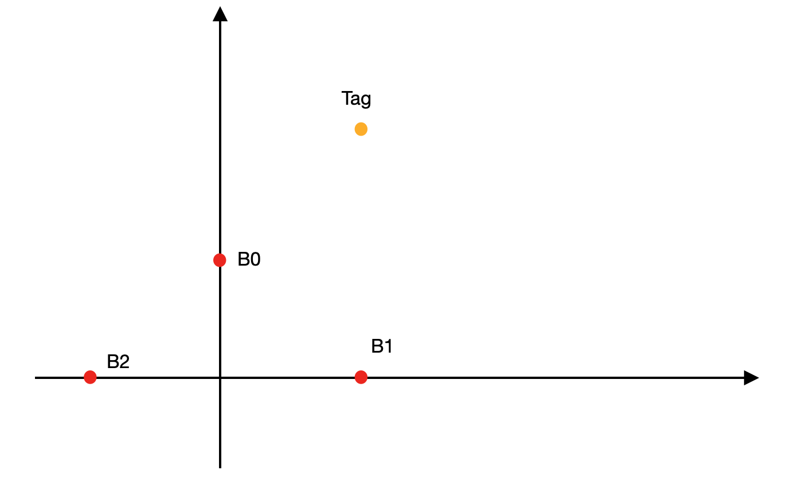
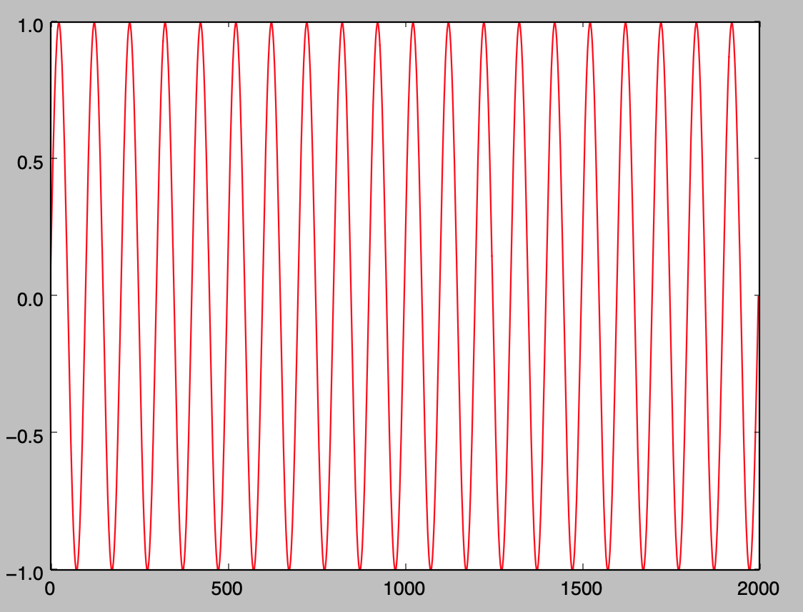
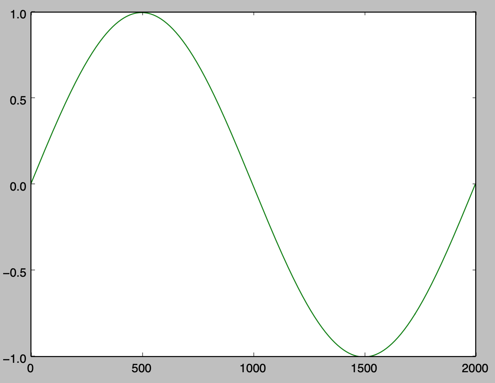
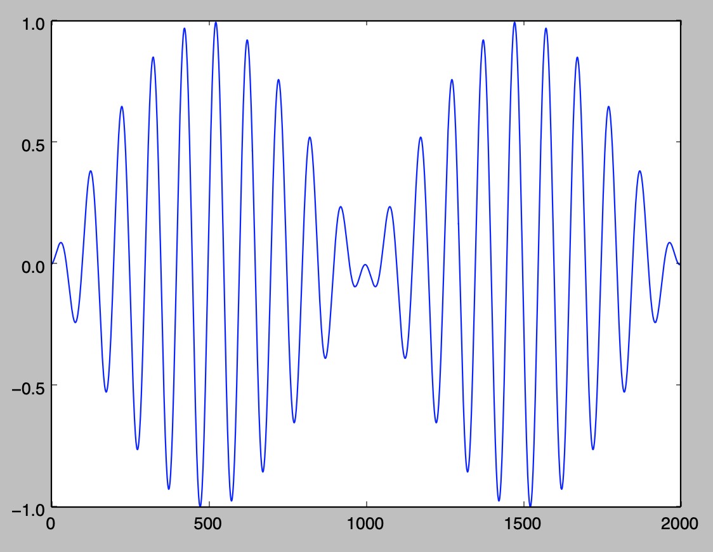
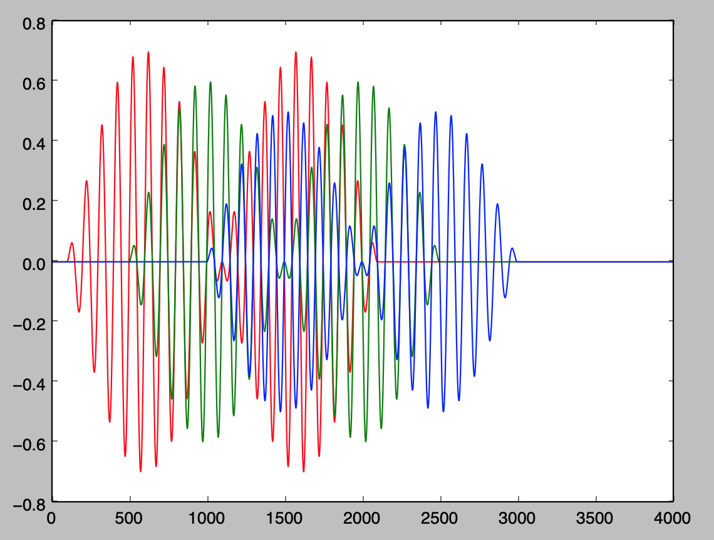
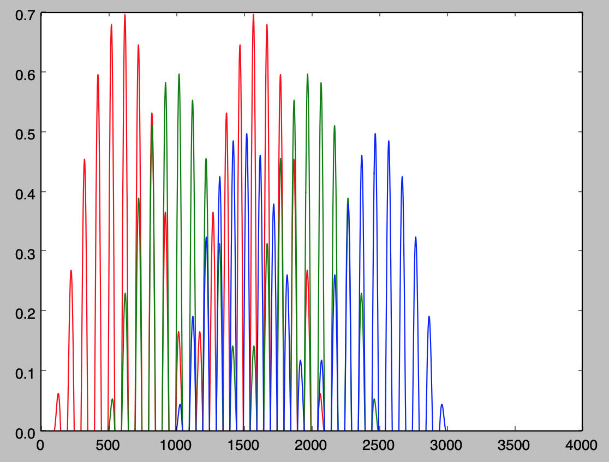
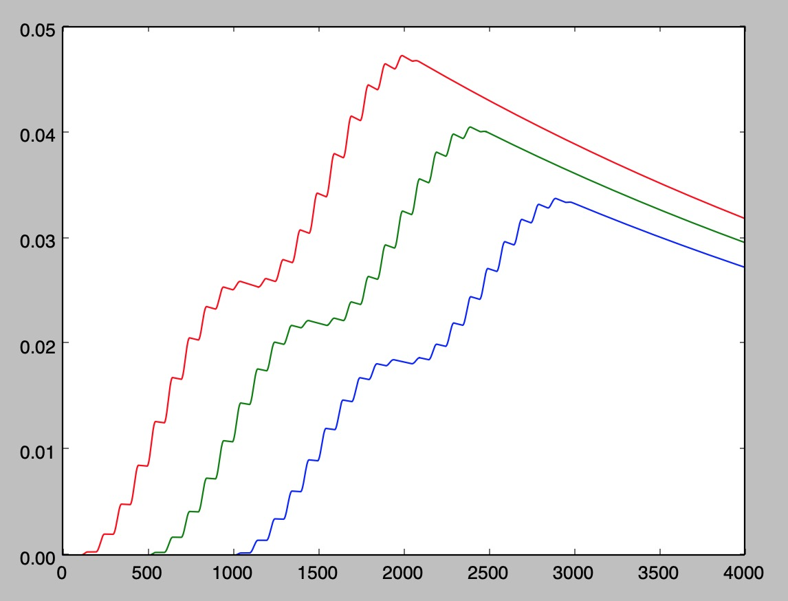

# 声源定位技术简介

最近因工作需要，学习了一下声源定位技术，将学习内容记录于此。
  
 
# 什么是声源定位技术

声源定位技术是指利用多个麦克风按一定的几何关系，排列成麦克风矩阵，同时对环境内的声音进行测量，然后利用算法对测量到的数据进行处理，然后获得发声点相对于麦克风矩阵的方向，距离等信息。

最常见的声源定位过程就是人耳的“听声辩位”，人通过两只耳朵接收声音，通过声音到达的时间和强度差异判断出发声点的方向。

当然，人耳的辨别精度往往没那么高，同时很多需要对声源需要定位场合也无法单单依靠人耳去实现。因此人们利用这个原理，通过麦克风矩阵和信号处理技术来实现更精确的，自动化的声源定位。这个技术已经被广泛应用于军事，工业，和消费类电子等领域。例如，在战场中，可以通过对枪声的定位来判断敌人狙击手的位置，一旦狙击手开枪，就可以立刻判断其位置，进行炮火覆盖，达到清除狙击手的目的；在工厂的设备研发和维护过程中，可以判断设备运行噪声的来源部位，对其进行精确的性能优化，故障诊断等。在消费类电子领域，智能音响通过麦克风矩阵判断与它对话的人的位置，进行针对性的降噪或实现专门的功能等。

# 如何利用麦克分矩阵对声源定位

如图所示，在此以能实现360度方向定位的三麦克风矩阵为例。在如图坐标系中，有声音发射源:
$$Tag（Tx,Ty)$$
三个接收点：
$${B_0(B_{0x},B_{0y})，B_1(B_{1x},B_{1y})，B_2(B_{2x},B_{2y})}$$

对于一次收发过程，有以下几何关系满足:

$$(T_x-B_{0x})^2+(T_y-B_{0y})^2=D_0^2 \tag{1}$$
$$(T_x-B_{1x})^2+(T_y-B_{1y})^2=D_1^2 \tag{2}$$
$$(T_x-B_{2x})^2+(T_y-B_{2y})^2=D_2^2 \tag{3}$$

其中$D_0$,$D_1$,$D_2$分别为Tag到$B_0$,$B_1$,$B_2$的距离,$B_0$ $B_1$ $B_2$的位置坐标已知。

声源发出声波，经过一定距离的传播，分别到达麦克风阵列的每个麦克风，由于传播距离的不同，每个麦克风接收到的声波的时间，相位，幅度都会有微小的差异。
声源定位技术就是通过分析这些微小的差异，来获得声源相对于麦克风矩阵的方位和距离信息。目前常用的定位方法有时间到达法，波束成型和高分辨率谱估计方法。

这里介绍一下最简单的用时间到达法来定位的详细过程。

发射机发射声波，经过一定时间的传播，到达接收机。接收机收到声波以后，可以把每个麦克风收到声波的时刻记录下来。

由于发射机到每个麦克风的距离会有细微的不同，因此其到达时刻也有轻微的不同，这个时间差乘以声速，就是距离之差。

因此，有以下关系被满足：
$$D0 = V_s*t_0 \tag{4}$$
$$D1 = V_s*t_1 \tag{5}$$
$$D2 = V_s*t_2 \tag{6}$$

$$t_0 - t_1 = t_{01} \tag{7}$$
$$t_1 - t_2 = t_{12} \tag{8}$$
$$t_2 - t_0 = t_{20} \tag{9}$$

式中，$V_s$为声音在空气中传播的速度，大概为340m/s。$t_0$,$t_1$,$t_2$为声波从发射开始，到经过空气传播，到达三个麦克风所经历的时间,当然由于在这个系统中，我们是没有办法知道声波何时开始发射的，因此我们无法直接求得$t_0$,$t_1$,$t_2$。但是我们是可通过算法处理麦克风的信号，来获得$t_0$,$t_1$,$t_2$相互之间的差值$t_{01}$,$t_{12}$,$t_{20}$。因此，在以上方程组中，$t_{01}$,$t_{12}$,$t_{20}$也是已知的。通过求解以上方程组，即可获得发声源的方向信息。其具体的求解过程篇幅较长，就不放在这里，感兴趣的同学可以试着推导一下。

## 近场模型与远场模型

以上这个方法是入射的声音看作是一个点发射出来球面波，分别沿着直线传播到各个麦克风的。直线之间有夹角存在。这个处理方式在声源定位算法中叫做近场模型。其好处是能精确的求的方向信息，但是如果求解过以上方程组可以知道，这个过程还是比较复杂的，而且求解出来的结果中，如果准确的知道方向信息。还要满足一定的约束条件才行。

为了近一步简化处理过程，还有一个方式是将入射的声波简化为平面波，它沿着平行的直线到达各个麦克风。这样可以简单的通过求解一次三角函数就简单的求解出方向。这种方式非常简单，但是也可以看出它求出的角度与实际角度会有一些偏差，这个偏差的大小和距离有关。通过仿真数据可以知道，模型本身的误差在0.3度左右。因此可以适用于对精度要求不严格的场合。

关于使用近场模型还是远场模型，目前并没有一个严格的标准，通常会使用一个经验公式来进行划分：
$$r=\frac{2L^2}{\lambda} \tag{10}$$
式中，L为麦克风阵列长度，$\lambda$为声波波长，当声源到麦克风阵列的距离D大于r时，使用远场模型，否则使用近场模型。

## 时差估计方法
有了以上原理，我们可以知道不管采用什么模型来进行，都需要知道声波信号到达各个麦克风的时间差。
常用的时间差的估计方法有相位差检测，互相关分析，最小均方自适应滤波等。

### 相位差检测
---
 
目前我自己实现的声源定位系统中，采用了超声波作为载波，并利用低频正弦波对其进行幅度调制，产生一个有一定特征的信号。因此可以直接使用相位差检测的方法来进行时延的估计。其具体过程如下。

首先发射端产生一个高频的超声波，频率25K。

然后用5KHz的正弦波进行调制。

得到以下波形，驱动超声波换能器发射出去

经过传播后，三个位置不同的麦克风会分别接收到的下图的信号，
它们在时延和幅值上都会有一些差异。

图中，红，绿，蓝分别为$B_0$,$B_1$,$B_2$接收到的信号。

然后对其截取正值信号,得到以下波形。

在经过简单的一阶低通滤波，之后的信号就变得非常干净，且峰值清晰，可以通过分别检测各个麦克风信号最大值的位置，进行比较即可获得时延信息。 

### 互相关分析
---
当然，以上这个方式对信号的频率和特征有一定的要求，适用于声源是主动被控发射的情况。如果声源信号不可控，例如对人说的的声音进行定位，则可以采用互相关分析的方法来处理。这里对该方法的处理过程进行简单的介绍。详细的过程可以参见参考资料。
信号的互相关性也就是信号的相似程度。在麦克风阵列中，多个麦克风是对同一个信号进行接收，因此各个麦克风的收到的信号应该是非常相似的，只会有幅度和时延上的差异。对于两个信号，因此如果我们找到了正确的时延差异，把它消除后，那么这时两个信号之间的相似程度就会最高，也就是其互相关性最强。基于这个思想，我们利用互相关分析的方法，找到互相关性最强的时候，对应的时延值就是正确的时延值了。具体的：
首先假设两个麦克风收到的同一个声波信号，其信号接收模型为：
$$x_1(n) = s(n-t_1)+n_1(n) \tag{11}$$
$$x_2(n) = s(n-t_2)+n_2(n) \tag{12}$$
其中$s(n)$为声源噪声，$n_1(n),n_2(n)$为高斯白噪声。$s(n)$，$n_1(n)$,$n_2(n)$之间互不相关。$t_1,t_2$是声波从声源分别传播到两个麦克风到时间，$t = t_1 - t_2$为两个麦克风之间的时间差。信号$x_1(n),x_2(n)$之间的互相关函数$R_{12}(t)$可表示为：
$$R_{12}(t)=E[x_1(n)x_2(n-t)] \tag{13}$$
将11，12代入13可得：
$$R_{12}(t)=E[s(n-t_1)s(n-t_1-t)] + E[s(n-t_1)n_2(n-t)] + $$
$$E[s(n-t_2-t)n_1(n)]+E[n_1(n)n_2(n-t)]\tag{14}$$
由于$s(n)$，$n_1(n)$,$n_2(n)$之间互不相关，因此：
$$E[s(n-t_1)n_2(n-t)] = 0$$
$$E[s(n-t_2-t)n_1(n)] = 0$$
$$E[n_1(n)n_2(n-t)] = 0$$
所以式14变为：
$$R_{12}(t)=E[s(n-t_1)s(n-t_1-t)] = R_r(t-(t_1-t_2)) \tag{15}$$
由自相关函数性质可知，当$t-(t_1-t_2)=0$时，$R_{12}$有最大值。而此时$t$就是$t_1,t_2$之间的时延值。

以上方法是最基本的互相关分析方法，能够实现基本的时延估计，但是在环境噪声比较高，声源有混响等情况下，会有较差的表现。因此为了解决这些问题，又有了改进的广义互相关，最小均方自适应滤波等一系列方法。感兴趣的读者可以参考相关资料。

